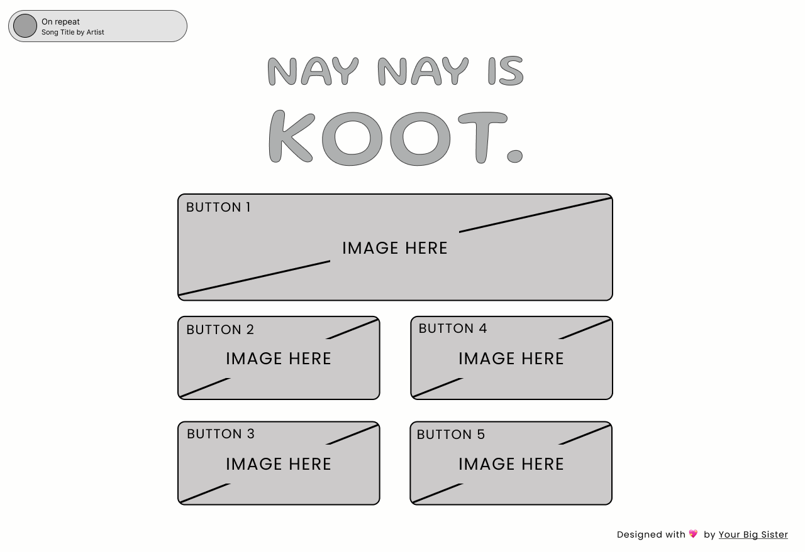
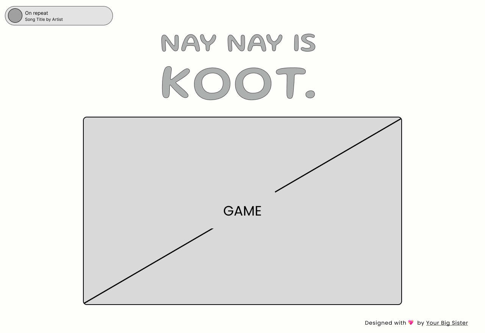

# Design Specifications
> This document outlines the design specifications for the _NAY NAY IS KOOT_, a single-page website that will host various quizzes, minigames, etc. for a 12-year-old audience. It covers the visual design, layout, and user interface elements of the website.

## **1. Project Overview**
*NAY NAY IS KOOT* is a web-based platform designed to provide engaging interactive activities for my 12 year-old sister. The platform will feature a single-page application with a Spotify widget for background music and a variety of microservice-based activities, including quizzes and minigames.

### 1.1 Stakeholders
The primary stakeholder for this project is my 12 year-old sister. 

Secondary stakeholders include our family, and my sister's friends. 

All users are assumed to be familiar with basic web navigation (clicking or tapping buttons, using a keyboard/mouse, back button functionality, etc). 

Interests include: *games*, *animation*, *music*, *absurdist comedy*. 

### 1.2 Design Goals
- Create a user-friendly, engaging interface
- Ensure responsive design for various devices
- Implement a modular structure for easy addition of new activities

## **2. Visual Design**

#### 2.1 Color Scheme

| Color | Purpose |
|--|--| 
|#FEFEFD |BACKGROUND |
|#58B2A2 |LOGO, SPOTIFY ICON |
|#383838 |TEXT |
|#2A786B |ACCENT/SHADING |
|#F9F2F9 |SPOTIFY BG |
|#308678 |SPOTIFY TEXT |

#### 2.2 Typography

## **3. Site Structure | Page Layout**
#### **3.1 Header**
#### 3.2 Spotify Playlist Widget
#### 3.3 Main Content Area
The main purpose of this page is to showcase various activities for the user to interact with. This page will have two different states, a 'menu' and an 'activity' state (more on this later).  
##### 3.31 Activity Selection (Default)

##### 3.32 Activity Display Window

#### 3.4 Footer

## **4. Content & Features**
## **5. Technical Specifications**
## **6. Project Timeline**
## **7. Future Considerations**
## **8. Appendix**
[MIGHT DELETE LATER]

## 1. Introduction
   [Brief overview of the project and purpose of this document]

### 2. User Interface Design
#### 2.1 Wireframes and Mockups
#### 2.2 Color Scheme
#### 2.3 Typography
#### 2.4 Responsive Design Specifications

## 3. Component Design
#### 3.1 Activity List
#### 3.2 Activity Display Window
#### 3.3 Spotify Widget
#### 3.4 Navigation Elements

## 4. User Flow Diagrams
   [Include user flow for main interactions]

## 5. Activity UI Specifications
#### 5.1 Math Quiz
#### 5.2 Vocabulary Matching
#### 5.3 Logic Puzzle
#### 5.4 Geography Quiz
#### 5.5 Pattern Recognition

## 6. Accessibility Guidelines
   [Detail accessibility standards to be followed]

## 7. Interaction Design
   [Specify hover states, animations, transitions, etc.]

## 8. Responsive Behavior
   [Detail how the design adapts across different screen sizes]