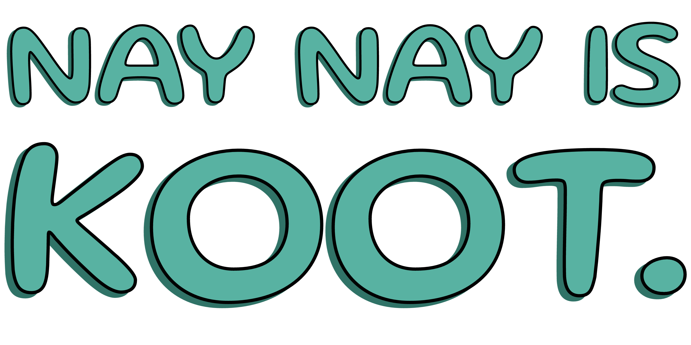

# Design Specifications
###### This document outlines the design specifications for the _NAY NAY IS KOOT_, a single-page website that will host various quizzes, minigames, etc. for a 12-year-old audience. It covers the visual design, layout, and user interface elements of the website. For the most up-to-date version and change history, please refer to the GitHub repository.

###### Last Updated: JULY 14 2024

****

### 1. Brand Identity
  #### 1.1 Logo
   [INCLUDE LOGO OR LINK TO FIGMA/CANVA DESIGN PAGE]
   - "NAY NAY IS KOOT" custom typography
   - Playful, hand-drawn style
   - Color: #4A90E2 (Blue)
  #### 1.2 Color Scheme
   | Color | Purpose |
   |--|--| 
   |#FEFEFD |BACKGROUND |
   |#58B2A2 |LOGO, SPOTIFY ICON |
   |#383838 |TEXT |
   |#2A786B |ACCENT/SHADING |
   |#F9F2F9 |SPOTIFY BG |
   |#308678 |SPOTIFY TEXT |
  #### 1.3 Typography
   [TODO]
  #### 1.4 Iconography
   [TODO]
### 2. User Interface Design
  #### 2.1 Wireframes and Mockups
  | Frame | Source |
  |--|--| 
  |Homepage | - [LINK]   - [LINK] |
  |Spotify Widget | [LINK] |
  ##### 2.1 
   The main purpose of this page is to showcase various activities for the user to interact with. This page will have two different states, a 'menu' and an 'activity' state (more on this later).  
  ##### 3.31 Activity Selection (Default)
   
  ##### 3.32 Activity Display Window
   
  #### 2.4 Responsive Design Specifications
## 3. Component Design
  #### 3.1 Activity List
  #### 3.2 Activity Display Window
  #### 3.3 Spotify Widget
  #### 3.4 Navigation Elements
## 4. Interaction Design
    [Specify hover states, animations, transitions, etc.]
## 5. Activity UI Specifications
  #### 5.1 Spy x Family Quiz
  #### 5.2 Music Game
  #### 5.3 Picture of the Day
## 6. Asset Specificatins 
 [IMAGES TO BE SOURCED]
 [ICONS TO BE DESIGNED/SOURCED]
## 6. Accessibility Guidelines
   [Detail accessibility standards to be followed]
## 7. User Flow Diagrams
   [Include user flow for main interactions]
## 8. Responsive Behavior
   [Detail how the design adapts across different screen sizes]

****
****
****
# v2
## 1. Brand Identity
  ### 1.1 Logo
  ### 1.2 Color Palette
  ### 1.3 Typography
  ### 1.4 Iconography
## 2. User Interface Design
  ### 2.1 Wireframes and Mockups
  ### 2.2 Color Scheme
  ### 2.3 Typography
  ### 2.4 Responsive Design Specifications
## 3. Component Design
## 4. Animation and Transition Specifications
## 5. Accessibility Guidelines
## 6. Asset Specifications
## 9. Version History
## 10. Future Considerations

While the following items are not planned for the initial MVP, they represent potential future enhancements to the design and user experience of Nay Nay is Koot:

### 10.1 Design Enhancements
- Implement a dark mode color scheme for improved accessibility and user preference
- Develop mobile-specific layouts and interactions for a fully responsive experience
- Create seasonal design variations for holidays or special events
- Introduce animated transitions between activities for a more dynamic feel

### 10.2 User Experience Improvements
- Implement user accounts to save progress and preferences
- Develop a customizable dashboard for users to pin favorite activities
- Introduce achievements or badges to gamify the platform usage

### 10.3 Content Expansions
- Allow for user-generated content, such as captions for Nay Nay's Daily Debut
- Expand the music library with user-curated playlists
- Introduce new themed activities based on user feedback and engagement metrics

### 10.4 Accessibility Advancements
- Implement advanced screen reader support for all activities
- Introduce customizable color contrast settings
- Develop alternative input methods for users with motor impairments

### 10.5 Integration and Interactivity
- Explore AR/VR possibilities for immersive Nay Nay experiences
- Investigate integration with smart home devices for interactive play
- Consider a companion mobile app for on-the-go engagement

These future considerations should be revisited and prioritized in subsequent design phases, always keeping in mind the core user experience and the project's overall goals.

## 11. Inspirations and Credits

***
***
***

# v3
# Design Specifications: Nay Nay is Koot

## Table of Contents
1. [Project Overview](#1-project-overview)
2. [Brand Identity](#2-brand-identity)
3. [User Interface Components](#3-user-interface-components)
4. [Activity Integration](#4-activity-integration)
5. [Responsive Design](#5-responsive-design)
6. [Animations and Transitions](#6-animations-and-transitions)
7. [Accessibility Considerations](#7-accessibility-considerations)
8. [Content Style Guide](#8-content-style-guide)
9. [Asset Specifications](#9-asset-specifications)
10. [Future Considerations](#10-future-considerations)
11. [Document Information](#11-document-information)

## 1. Project Overview

"Nay Nay is Koot" is a web-based entertainment platform designed for my 12-year-old sister, featuring interactive games and activities centered around our family's Chihuahua, Chanel (aka Nay Nay, Nay-Nay, Cha-Nay-Nay, Nelly-Belly).

For detailed project information, including objectives, scope, and stakeholders, please refer to the [Project Charter](./PROJECT_CHARTER.md) document in this repository.

## 2. Brand Identity

### 2.1 Logo
- "NAY NAY IS KOOT" custom typography
- Playful, hand-drawn style
- Color: #4A90E2 (Blue)

### 2.2 Color Palette
| Element    | Color Code | Sample                                                       |
|------------|------------|--------------------------------------------------------------|
| Primary    | #4A90E2    |  |
| Secondary  | #50E3C2    |  |
| Accent     | #F5A623    |  |
| Background | #F8F8F8    |  |
| Text       | #333333    |  |

### 2.3 Typography
- Headings: 'Rubik', sans-serif (Bold)
  - H1: 32px
  - H2: 24px
  - H3: 18px
- Body Text: 'Open Sans', sans-serif (Regular), 16px
- Button Text: 'Rubik', sans-serif (Medium), 14px

### 2.4 Iconography
- Custom-designed icons for each activity
- Style: Flat design with 2px stroke
- Base size: 24x24px, scalable

## 3. User Interface Components

### 3.1 Header
- Logo placement: Top-left
- Navigation menu: Right-aligned, horizontal on desktop
- User-friendly, clickable areas for touch devices

### 3.2 Activity Selection Screen
- Grid layout of activity cards
- Card design:
  - Size: 250px x 150px (desktop)
  - Content: Icon, title, brief description
  - Hover state: 2px elevation, 10% darken background

### 3.3 Activity Display Area
- Full-width container
- Consistent padding: 24px
- "Back to Activities" button: Top-left, high contrast

### 3.4 Music Player
- Position: Fixed, bottom-right
- Collapsed state: 50px height
- Expanded state: 200px height
- Controls: Play/Pause, Next, Previous, Volume
- Now Playing information: Track name, Artist

## 4. Activity Integration

The Nay Nay is Koot platform integrates several activities as microservices. Each activity has its own detailed design specification document. The platform provides a consistent framework for displaying and interacting with these activities.

### 4.1 Activity Microservices
The following activities are integrated as microservices. For detailed design specifications of each activity, please refer to their respective documents:

1. [Nay Nay's Daily Debut Design Specifications](./activities/DAILY_DEBUT_DESIGN_SPEC.md)
2. [Spy x Family Personality Quiz Design Specifications](./activities/SPY_FAMILY_QUIZ_DESIGN_SPEC.md)
3. [Melody Maker: Sewer Symphony Design Specifications](./activities/MELODY_MAKER_DESIGN_SPEC.md)
4. [Starlight Puppy Dash: Cosmic Adventure Design Specifications](./activities/STARLIGHT_PUPPY_DASH_DESIGN_SPEC.md)

## 5. Responsive Design

### 5.1 Breakpoints
- Desktop: 1024px and above
- Tablet: 768px to 1023px

### 5.2 Adaptations
- Activity grid: 3 columns (desktop), 2 columns (tablet)
- Font sizes: Reduce by 20% on tablet
- Music player: Collapses to minimal view on tablet
- Navigation: Converts to dropdown menu on tablet

## 6. Animations and Transitions

### 6.1 Page Transitions
- Subtle fade transition between pages/activities
- Duration: 300ms
- Easing: ease-in-out

### 6.2 Interactive Elements
- Buttons: Scale up slightly (1.05) on hover, scale down (0.98) on active
- Activity cards: Smooth elevation change on hover

### 6.3 Activity-Specific Animations
- Nay Nay's Daily Debut: Custom reveal animation (e.g., curtain effect)
- Melody Maker: Subtle animations for note placement and instrument changes
- Starlight Puppy Dash: Particle effects for movement, star collection, and collisions

## 7. Accessibility Considerations

- Color contrast: Minimum 4.5:1 ratio for text readability
- Button and interactive element size: Minimum 44x44px touch target
- Focus indicators: Visible outlines for keyboard navigation
- Text alternatives: All images and icons to have descriptive alt text

## 8. Content Style Guide

### 8.1 Tone of Voice
- Playful and friendly
- Age-appropriate for target user (12-year-old)
- Encouraging and positive reinforcement in games

### 8.2 Writing Style
- Short, clear sentences
- Use of simple, familiar words
- Incorporation of dog-related puns and playful language

## 9. Asset Specifications

### 9.1 Images
- Nay Nay Photos: JPEG/PNG, min 1200x800px, 100+ unique images
- Activity Icons: SVG, 24x24px base size, scalable
- Backgrounds: JPEG/WebP, 1920x1080px, themed per activity
- UI Elements: SVG/PNG with transparency, 2x size for retina

### 9.2 Audio
- Background Music: MP3/OGG, 128kbps min, 2-3 minute loops
- Sound Effects: MP3/OGG, 192kbps, <2 seconds each

### 9.3 Fonts
- Rubik: WOFF2/WOFF, weights 400, 500, 700
- Open Sans: WOFF2/WOFF, weights 400, 600

### 9.4 Animations
- Loading Animations: CSS or Lottie JSON, 2-3 second loops
- Transition Animations: CSS or SVG, 300-500ms duration
- Game Animations: Sprite sheets (PNG) or Spine animations

### 9.5 Asset Organization
- Consistent naming convention: activity-name_asset-type_descriptor
- Organized folder structure for images, audio, fonts, animations

## 10. Future Considerations

While the following items are not planned for the initial MVP, they represent potential future enhancements to the design and user experience of Nay Nay is Koot:

### 10.1 Design Enhancements
- Implement a dark mode color scheme
- Develop mobile-specific layouts and interactions
- Create seasonal design variations for holidays or special events

### 10.2 User Experience Improvements
- Implement user accounts to save progress and preferences
- Develop a customizable dashboard for favorite activities
- Introduce achievements or badges to gamify the platform usage

### 10.3 Content Expansions
- Allow for user-generated content, such as captions for Nay Nay's Daily Debut
- Expand the music library with user-curated playlists
- Introduce new themed activities based on user feedback

### 10.4 Accessibility Advancements
- Implement advanced screen reader support for all activities
- Introduce customizable color contrast settings
- Develop alternative input methods for users with motor impairments

## 11. Document Information

This design specifications document is part of the "Nay Nay is Koot" project repository. For the most up-to-date version and change history, please refer to the GitHub repository.

Last Updated: 2024-07-11

Author: Elora Hoberecht

---

For any questions or suggestions regarding this design specification, please open an issue in the GitHub repository or contact the author directly.