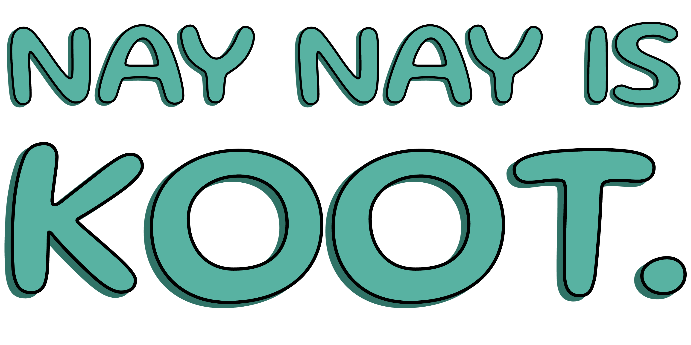

# **Project Charter** 
|||
|--| --|
| Project| NAY NAY IS KOOT |
| Version | 1.0
| Status | Design in progress 🚧 |
| Last Update | JULY 10 2024 |
| Author | Elora Hoberecht |
| Notes| |
## **1. Project Overview**
*NAY NAY IS KOOT* is a web-based platform designed to provide engaging interactive activities for my 12 year-old sister. The platform will feature a single-page application with a Spotify widget for background music and a variety of microservice-based activities, including quizzes and minigames.

## **2. Project Objectives**

## **3. Scope**

## **4. Stakeholders**

## **5. Timeline**

## **6. Budget**

## **7. Success Criteria**